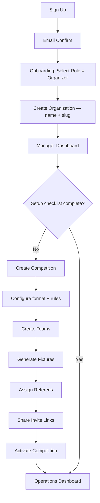
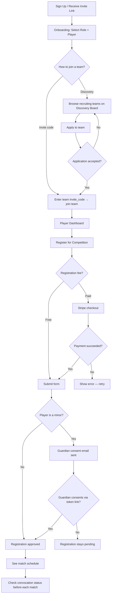
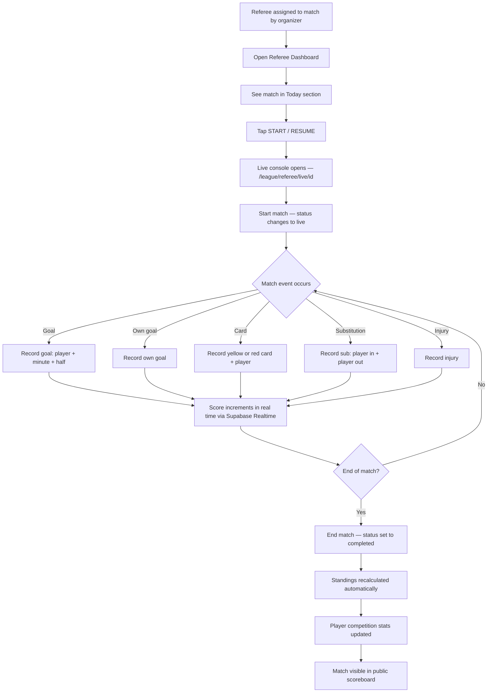
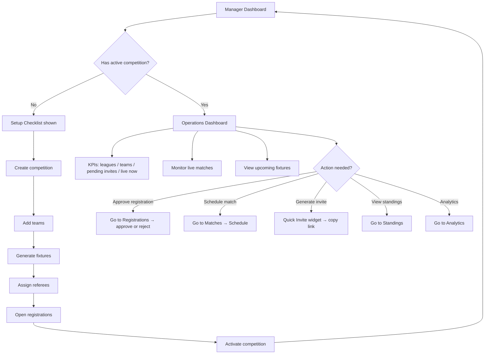
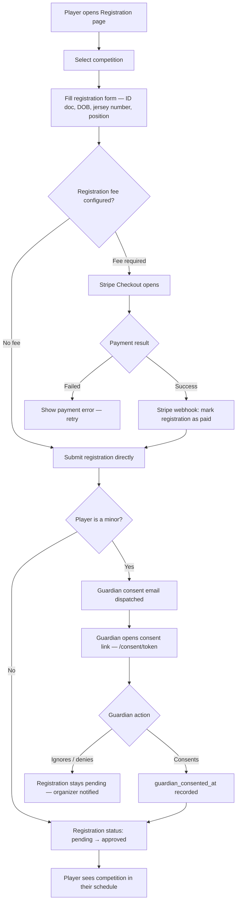
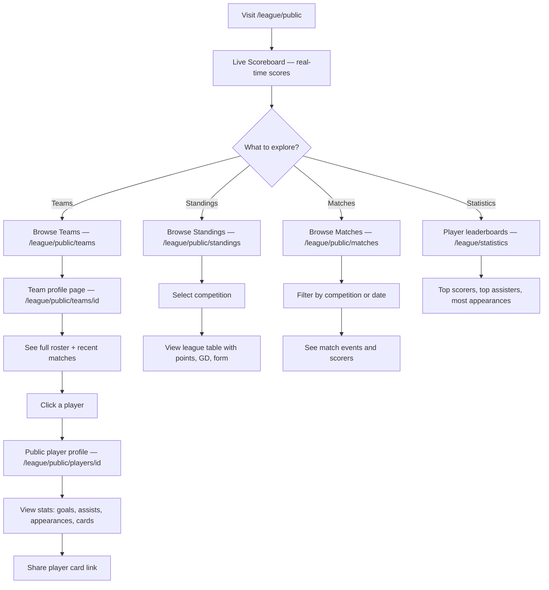

# PLYAZ — User Flow Diagrams

All flows are rendered with Mermaid. Use GitHub, GitLab, or a Mermaid-compatible viewer to see the diagrams.

---

## Flow 1: New Organizer Onboarding

A new user registers as a league organizer, creates their first competition, and prepares it for launch.

---

## Flow 2: Player Journey

A player joins a team, registers for a competition, and tracks their match day status.

---

## Flow 3: Match Day (Referee)

The referee receives an assignment, opens the live console, and records events in real time.

---

## Flow 4: Manager Operations

Day-to-day operations once a competition is live.

---

## Flow 5: Registration + Payment

The full player registration path including optional Stripe payment and guardian consent.

---

## Flow 6: Public Fan Experience

A visitor explores the league without creating an account.

